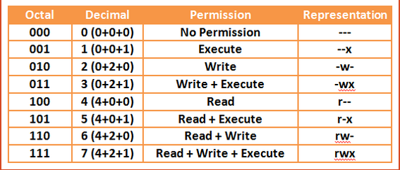

---

tags: ["tanishuv", "fayllar", "stdout", "permissions"]

---
## Linux-guide / Linux-qo'llanma

Bu yerda, Linux va unga oid turli-xil dasturlar haqida ma'lumot ulashaman. Malumotlarni tartib bo'yicha yozishga harakat qilaman, lekin o'zimning yo'l xaritam mutlaqo tartibsiz. Qachondir yangi narsa o'rgansam, shu yerga qo'shib qo'yaman. Bu qo'llanma nafaqat yangi Linux foydalanuvchilari uchun, balki tajribali Tizim Administratorlari ham oz'lariga kerakli biror malumot topishlari mumkin deb o'ylayman. Umid qilamanki, ushbu qo'llanma sizga va albatta menga ham foydasi tegadi. 

## Salom Dunyo!


Keling, an'anaga rioya qilgan holda "Salom Dunyo" kodini yozamiz. Terminal oynasini ochib quyidagi buyruqni kiriting. 

```bash
$ echo "Salom, dunyo!"
Salom, dunyo!
```

>Terminal oynasini tezkor ochish - `CTRL` + `ALT` + `T`

## Parolni o'zgartirish

Linux'da joriy foydalanuvchining parolini o'zgartirish `passwd` (password) buyrug'i yordamida amalga oshiriladi. U birinchi navbatda avvalgi parolingizni so'raydi, to'g'ri kiritsangiz, parol yangilanadi. Agar buyruq **"root"** tomonidan berilsa,  u holda faqatgina **"root"** foydalanuvchisining paroli o'zgaradi. 

~~~bash
$ passwd
Enter your first password: ****
Enter your new password: ****
Password set successfully!
~~~

## Joriy katalogni chop etish

`pwd` (print-working-directory) terminaldagi joriy ishchi manzilini chop etadi. Etibor bering `$` belgisi oddiy foydalanuvchiga, `#` belgisi esa **root** foydalanuvchiga ishora qiladi. Terminalda `#` belgisini ko'rsangiz, bilingki siz tizim ustidan to'liq boshqaruv kuchiga egasiz.

~~~bash
$ pwd
/home/khumoyun
~~~

## Papka yaratish & o'chirish

`mkdir` (make-directory) buyrug'i yordamida bir nechta bo'sh papka yaratish mumkin.

```bash
$ mkdir papka1 papka2 papka3
```

Bo'sh papkani o'chirish uchun `rmdir` (remove-directory) buyrug'idan foydalaning. Agar papka bo'sh bo'lmasa, buyruq bekor qilinadi - papka o'chirilmaydi.

```bash
$ rmdir papka1 papka2 papka3
```

Bo'sh bo'lmagan papkalarni quyidagi buyruq orqali o'chirish mumkin:

```bash
$ rm -r bosh-bolmagan-papka
```

Ya'ni bu yerda `-r` (recursive) optsiyasi papka ichidagi kontentlarni hammasiga `rm` buyrug'ini beradi.

## Fayllar ro'yxatini olish

```bash
$ ls
```

Agar siz `-l`  (long-listing) optsiyasini qo'shsangiz, u ruxsatlar (permissions), o'zgartirilgan sana (last-modified-date), fayl yoki papkaga egalik qiluvchi foydalanuvchilar (owners) va boshqa foydali ma'lumotlarni o'z ichiga oladi.

```bash
$ ls -l
total 36
drwxr-xr-x  4 khumoyun khumoyun 4096 Aug  7 19:10 Desktop
drwxr-xr-x  3 khumoyun khumoyun 4096 Aug  7 16:40 Documents
drwxr-xr-x  2 khumoyun khumoyun 4096 Aug  7 01:32 Downloads
...
```

Odatda, `ls` buyrug'i yashirin fayllarni ko'rsatmaydi chunki ular ko'pincha foydalanuvchiga keraksiz va ekranda ortiqcha joyni egallaydi. Yashirin fayllarni majburiy ko'rish uchun `-a` (all) optsiyasini qo'shish kifoya.

```bash
$ ls -a
```

Ba'zan siz fayl nomlarini qatorma-qator (ortiqcha ma'lumotlarsiz) ekranga chiqarishni hoxlaysiz:

```bash
$ ls -1
```

### Qiziq xolat

Hmm, biz `ls / > list.txt` buyrug'i "list.txt" ichiga quyidagi matnni kiritishini kutamiz:

```
bin   dev  home  lib32  libx32      media  opt   root  sbin  srv       sys  usr
boot  etc  lib   lib64  lost+found  mnt    proc  run   snap  swap.img  tmp  var
```

Lekin aslida:

```
bin
boot
dev
etc
home
lib
lib32
lib64
libx32
lost+found
media
mnt
...
```

Yuqoridagi variant dasturchilarga qulayroq bo'lgani sababli, faylga huddi shunday tartibda yoziladi. O'ylab ko'ring, agar fayl nomlari qatorma-qator yozilsa, ularni manipulatsiya qilish ancha ossonroq bo'ladi. Ko'rinib turibdiki, ba'zi buyruqlarning natijalari faylga siz kutgandek yo'naltirilmaydi va buning ortida "yaxshiroq" sabab bor. 

## StdOut'ni faylga yo'naltirish

Quyidagi buruq `new_file.txt` nomli fayl ichiga **"bu oddiy satr"** matnini kiritadi. Diqqat, agar fayl mavjud bo'lmasa, u **yangi yaratiladi**. Agar fayl ichi bo'sh **bo'lmasa**, fayl **qaytadan yoziladi** ya'ni eski kontent o'chirilib yangisi yoziladi.

```bash
$ echo "bu oddiy satr" > new_file.txt
```

Faylga qo'shib yozish `>>` yordamida amalga oshiriladi:

```bash
$ echo "bu oddiy satr" >> new_file.txt
```

Natija:

```new_file.txt
bu oddiy satr
bu oddiy satr
```

Tushunarli, lekin natijani qanday qilib bir nechta fayllarga bir vaqtning o'zida yozish mumkin deyishingiz mumkin, va bu juda ham oddiy:

```bash
$ dastur | tee file1.txt file2.txt
```

> `tee` buyrug'i dastur natijasini bir yoki bir nechta manzillarga yozadi. Pipe operatori (|) haqida keyinroq to'xtalib o'taman.

## Fayllarni nusxalash

Faylni nusxalash:

```bash
$ cp fayl ../masofa/fayl
```

Bir nechta fayllarni nusxalash:

```bash
$ cp fayl1 fayl2 fayl3 fayl4 joy/
```

Bo'sh papkani nusxalash:

```bash
$ cp papka ../masofa/papka
```

Bo'sh bo'lmagan papkani nusxalash, `-r` (recursive) optsiyasi bilan:

```bash
$ cp -r papka masofa_joy/
```

## Fayl/papkani qidirish

Bizga kerakli buyruq ba'zi Linux distributivlarida mavjud emas va shu sababli `apt` yoki o'zingiz foydalanayotgan distributivda mavjud bo'lgan package-manager'dan `plocate` dasturini o'rnatishni maslahat beraman:

```bash
$ sudo apt install plocate
$ locate hi.txt
/root/hello/hi.txt
```

Agar u siz qidirayotgan narsani topolmasa, ma'lumotlar bazasini yangilang.

```bash
$ updatedb
$ locate hi2.txt
/root/hello/hi2.txt
```

## Fayl/papka permissions (ruxsatlar)

**Sintaks:** *FAYL_TIPI + FOYDALANUVCHI_RUXSATLARI + GURUX_RUXSATLARI + BOSHQALAR*

**Tiplar:** 
- **D**: directory (papka)
- **L**: link (havola)
- **F**: file (fayl)

**Misol:** 

```
dr-xr-x---
```

Tablitsani yodlab olishni maslahat beraman - juda kerakli:



## Ruxsatlarni o'zgartirish 

Yuqoridagi tablitsaga qarab, faylni boshqa foydalanuvchilar tomonidan bajarilishi yoki o'qilishi mumkinligini belgilash. Faylni bajariladigan qilish quyidagicha:

```bash
$ chmod +x file_name.sh
```

Boshqa foydalanuvchilar shaxsiy malumotlaringizni o'qishini oldini olish uchun:

```bash
$ chmod 600 shaxsiy.txt
```

## Eng xavfli buyruq

Hech kimga **o'qish+yozish+bajarish** ruxsatini bermang - bu juda katta xato.

```bash
$ chmod 777 file.txt 

yoki

$ chmod guo+rwx file.txt
```

## Foydalanuvchi qo'shish/o'chirish

Foydalanuvchi qo'shish juda oddiy. Quyidagi buyruqni kiriting so'ngra siz foydalanuvchi uchun yangi parol o'rnatishingiz va bir nechta ixtiyoriy savollarga javob berishingiz kerak bo'ladi.  Ushbu vaziyatda Bob ismli foydlanuvchi yaratildi:

```bash
$ adduser Bob
```

Foydalanuvchini o'chirib tashlash:

```bash
$ deluser Bob
```

## Foydalanuvchilarni almashtirish

`su` (switch-user) buyrugi yordamida siz istalgan foydalanuvchining akkauntiga kirishingiz mumkin. E'tibor bering, agar siz root foydalanuvchisiga o'tayotgan bo'lsangiz, `sudo`  ishlatishingiz zarur.

```bash
$ sudo su root
```

Enter bosilgach, sizdan "root" foydalanuvchisining paroli so'raladi.

## `/etc/passwd`

**/etc/passwd** fayli tizimga kirishda zarur bo'lgan ma'lumotlarni saqlaydi. Boshqacha qilib aytganda, u foydalanuvchilarning hisob ma'lumotlarini saqlaydi. **/etc/passwd** oddiy matnli fayldir.  U har bir hisob uchun foydalanuvchi identifikatori, guruh identifikatori, uy katalogi, qobiq va boshqa foydali ma'lumotlarni taqdim etadi. Batafsil [bu yerda](https://www.cyberciti.biz/faq/understanding-etcpasswd-file-format/)

## `/etc/shadow`

**/etc/shadow** faylida barcha parollaringiz shifrlangan formatda saqlanadi. Faylni faqat "root" foydalanuvchisi ko'ra oladi.

**P.S.** Hashcat va JohnTheRipper kabi dasturlar shifrlangan parollarni buzish uchun ishlatiladi. Parol qanchalik kuchli bo'lsa, buzish shunchalik murakkab.

## `/var/log/auth.log`

Bu fayl tizimga kirgan/chiqgan foydalanuvchilar ro'yxatini saqlaydi. Quyidagi kod har soniyada `auth.log` kontentini ekranga chiqaradi.

```bash
$ watch "cat /var/log/auth.log"
```

## Sizning ikkinchi eng yaxshi do'stingiz...

Siz ba'zi buyruqlar yoki optsiyalarni tariflarini unutishingiz mumkin, ammo `man` deyarli barcha buyruqlarni yetarlicha tavsifini offline tarzda chiqarib beradi. Bu Google'dan keyingi ikkinchi eng yaxshi do'stingiz. Sintaksi quyidagicha:

```bash
$ man kerakli_buyruq
```

>**Q** tugmasini bosish orqali `man` sahifasidan chiqish mumkin.

Shuni yodda tutish kerakki, `man` ba'zi buyruqlar tavsifini chiqarmaydi, masalan `cd`, `exit`, `source`, `type`, `export` va hokazo.

## Samaradorlikni oshiring

1. **CTRL + L** - terminalni tezkor tozalaydi
2. **CTRL + U** - kursordan chapga tozalaydi
3. **CTRL + K** - kursordan o'ngga tozalaydi
4. **CTRL + A** - kursorni satr boshiga qo'yadi
5. **CTRL + E** - kursorni satr oxiriga qo'yadi
6. **CTRL + ALT + T** - yangi terminal oyna ochish 
7. **SUPER + TAB** - oynalarni tezkorlik bilan alishtirish
8. **CTRL + ALT + ARROW_KEYS** 

## Linux buyruqlari - cheatsheet

Ba'zi buyruqlar esingizdan chiqishi mumkin hattoki men ham ba'zan yozgan maqolalarimni o'qib turaman. 

**["cheatsheet" uchun xavola](./images/linux-commands-cheatsheet.png)**

```bash
$ alias cheatsheet="$(xdg-open '/.../cheatsheet.png')"
```

> `alias` - o'zgaruvchi e'lon qiladi va asosan uzun buyruqlarni qisqartirish uchun ishlatiladi. Misol uchun, ob-havoni ko'rsatadigan qisqa buyruq:
> `alias wtr='curl https://wttr.in/Fergana'` 
> 
> Agar buyruqni bir nechta terminal seanslarida ishlashini istasangiz, kodni uy manzilidagi `.bashrc` fayli ichiga qo'shib yozing. Darvoqe, `.bashrc` fayli bash terminal oynasi ochilganda birgalikda ishga tushadigan dastur hisoblanadi. 


[02-kun >](02-dars.md)
