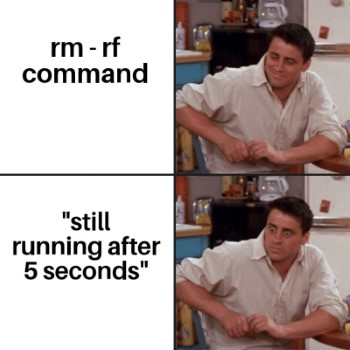
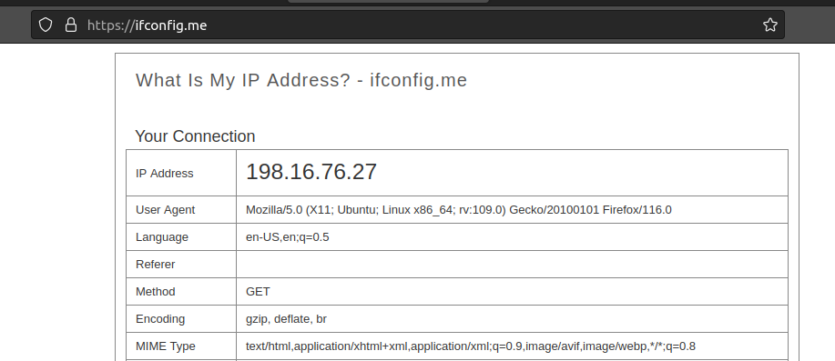
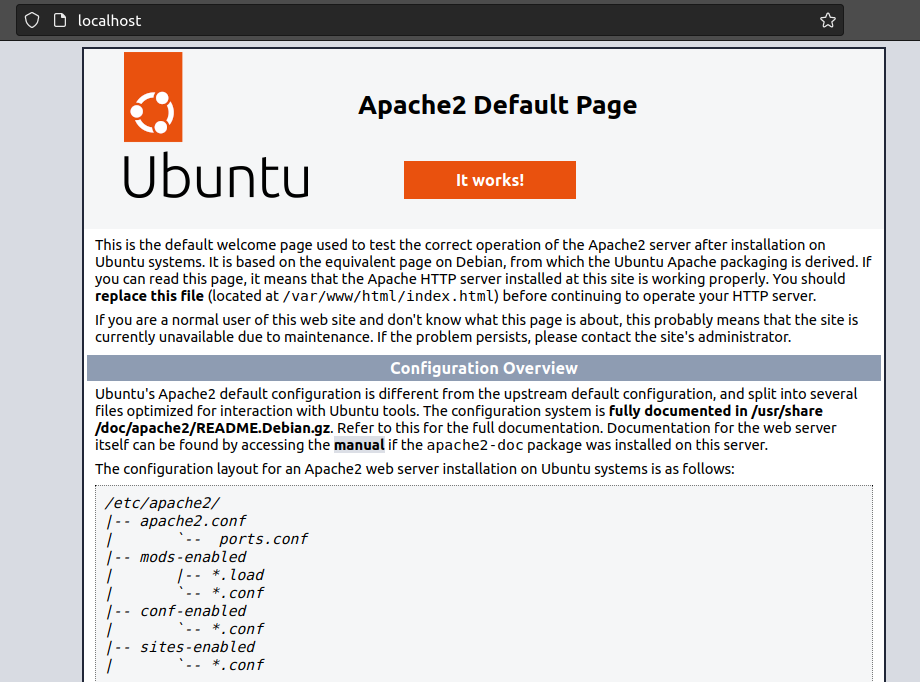

---

tags: ["xizmatlar"]

---
## Zarur!

Linux'ni o'rganar ekansiz, sizga IP manzillar, subnet, OSI Model,  TCP/UDP protokollar, tunel, port, xost kabi turli-xil tarmoqga oid terminlarga duch kelasiz. Shu sababli, ular haqida Internet'da yetarlicha "research" qilishingizni maslahat beraman. Muhimi, dangasa bo'lmang. Siz buni uddalaysiz! ;). Ba'zi terminlar:

- Networking Fundamentals
- CCNA course 
- [Networking for dummies](https://edu.anarcho-copy.org/TCP%20IP%20-%20Network/Networking%20For%20Dummies.pdf) (kitob)
- Network administration course
- Network penetration testing course

## Bir nechta fayllar yaratish & o'chirish

`touch` buyrug'i nafaqat fayllarni o'zgartirilgan sanasini yangilaydi, balki u yangi fayllarni yaratishga ham qodir:

```bash
$ touch fayl-1 fayl-2 fayl-3 fayl-4 fayl-5
$ ls
fayl-1  fayl-2  fayl-3  fayl-4  fayl-5
```

Barcha fayllarni o'chirish uchun "\*" belgisidan foydalanasiz. 

```bash
$ rm *
$ ls
```

>Ba'zan internetda `sudo rm -rf /` buyrug'i bilan "meme"larga duch kelasiz. Bu buyruq **sistemadagi barcha fayllarni o'chirib tashlaydi**, va bu qaytarib bo'lmas jarayon. 



## Ommaviy IP (Internet Protocol) manzilni aniqlash

```
$ curl ifconfig.me
xxx.xx.xx.xxx
```

Muqobil ravishda, [ifconfig.me](https://ifconfig.me) saytiga tashrif buyursangiz ham bo'ladi (aytgancha, men proxy'dan foydalanyapman :) ).



## `service` va `systemctl`

`service` va `systemctl` ikkalasi ham tizim xizmatlarini boshqarish uchun foydalaniladigan vositalardir. Ular xizmatlarni yoqish, o'chirish, qayta ishga tushirish usullarini taqdim etadi. Farqi, `systemctl` yanada keng xususiyatlarga ega va u xizmatlarni boshqarishning standart usuliga aylanib bormoqda. 

>systemctl = new
>
>service = old 

## Veb-server yaratish

Veb-server yaratish uchun `apache2` dasturini ustanovka qilishimiz zarur.

```bash
sudo apt install apache2
```

So'ngra, quyidagi buyruq orqali veb-serverni ishga tushiramiz, 80-portda.

```bash
service apache2 start
```

Veb-server muvaffaqiyatli ishga tushganini bilish uchun `service apache2 status` buyrug'ini kiritasiz va u quyidagidek xabarni ekranga chiqarishi kerak:

```bash
$ service apache2 status
● apache2.service - The Apache HTTP Server
     Loaded: loaded (/lib/systemd/system/apache2.service; enabled; vendor prese>
     Active: active (running) since Sat 2023-08-12 04:42:14 EDT; 2h 0min ago
       Docs: https://httpd.apache.org/docs/2.4/
    Process: 901 ExecStart=/usr/sbin/apachectl start (code=exited, status=0/SUC>
   Main PID: 959 (apache2)
      Tasks: 55 (limit: 4474)
     Memory: 7.3M
        CPU: 538ms
     CGroup: /system.slice/apache2.service
             ├─959 /usr/sbin/apache2 -k start
             ├─961 /usr/sbin/apache2 -k start
             └─962 /usr/sbin/apache2 -k start
```

Endi esa brovzeringizni ochib, "[localhost](http://localhost)" yoki [127.0.0.1](http://127.0.0.1) manzilini qidiruv paneliga yozing.



Veb-serverimiz tayyor. Veb-sahifani to'liq o'zgartirish uchun fayl-menejeringizni `/var/www/html/` joylashuvida oching va o'zingizni veb sahifalaringizni o'sha yerga joylasangiz bo'ladi (`index.html`  - saytning bosh sahifasi). Veb-serverni o'chirib qo'yish uchun esa `service apache2 stop` burug'idan foydalanasiz!

## SSH serverni ishga tushirish

Avval `openssh-server` dasturini o'rnatishimiz zarur (bu kompyuterda tashqi qurilmalar ulanishi mumkin bo'lgan ssh port yaratadi).

```bash
sudo apt install openssh-server
```

So'ng, ssh xizmatini yoqishimiz mumkin (bilaman, `service` kommandasi eski, lekin bu barcha Linux distrolarida ishlaydi.):

```bash
service ssh start
```

status ya'ni holatni ni aniqlash uchun:

```
$ service ssh status
● ssh.service - OpenBSD Secure Shell server
     Loaded: loaded (/lib/systemd/system/ssh.service; enabled; vendor preset: e>
     Active: active (running) since Sat 2023-08-12 04:42:14 EDT; 2h 19min ago
       Docs: man:sshd(8)
             man:sshd_config(5)
    Process: 909 ExecStartPre=/usr/sbin/sshd -t (code=exited, status=0/SUCCESS)
   Main PID: 931 (sshd)
      Tasks: 1 (limit: 4474)
     Memory: 2.1M
        CPU: 52ms
     CGroup: /system.slice/ssh.service
             └─931 "sshd: /usr/sbin/sshd -D [listener] 0 of 10-100 startups"
```

Ko'rib turganingizdek, ssh-servis muvaffaqiyatli ishga tushdi. Endi siz istalgan qurilma orqali kompyuteringizga bog'lanishingiz mumkin (albatta ular bir xil tarmoqda bo'lsa yoki qurilmangizga ommaviy IP ulangan bo'lsa va u port-forwarding xususiyatiga ega bo'lsa - ba'zi routerlarda bunday funksiya mavjud va uni gateway IP adresga brovzer orqali kirib sozlash mumkin). Misol:

```bash
$ ssh root@192.168.43.5
password: ****
successfully logged in as user "root"
root~$ 
```

SSH haqida ko'proq ma'lumot olish uchun, quyidagi resurslar bilan tanishib chiqing:
 
 - [SSH nima?](https://www.websiterating.com/uz/web-hosting/glossary/what-is-ssh/)
 - [Ubuntu'da SSH server o'rnatish](https://uz.termotools.com/8299-installing-ssh-server-in-ubuntu.html)

## Xizmatlar boshqaruvi - systemctl

```
$ systemctl <verb> <service>

<verb> = start/restart/stop
<service> = ssh/apache2/nginx/...
```

> Bundan buyog'iga xizmatlarni servislar deb atayman.

### Servisni yoqish

```bash
systemctl start ssh
```

### Servisni o'chirish

```bash
systemctl stop ssh
```

### Servisni qayta ishga tushirish

```bash
systemctl restart ssh
```

## Foydali bo'ladi
 
 - **CTRL + C**  - ko'pincha script yoki terminaldagi dasturdan chiqish uchun qo'llaniladi.
 - **CTRL + D** - terminal yoki dasturdan chiqish uchun qo'llaniladi
 - **CTRL + SHIFT + C** - belgilangan matnni nusxalaydi
 - **CTRL + SHIFT + V** - nusxalangan matnni belgilangan joyga qo'yadi

[< 02-kun](02-dars.md) | [04-kun >](04-dars.md)
