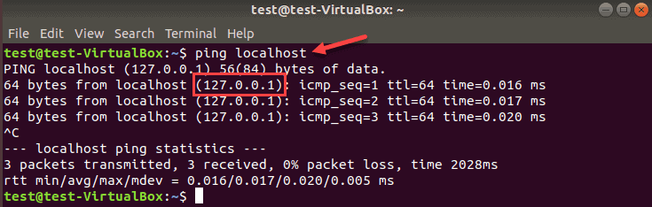

---

tags: ["nmap"]

---
## Shebang

Shebang dasturni qanday turkumdaligini aniqlash uchun kodning boshiga qo'yiladi. U Python, Bash yoki Awk scriptlash tillari bo'lishi mumkin. Sintaksis esa quyidagicha:

```bash
#!/bin/bash
```

## Serverga "ping" so'rov yuborish



`ping` host tirik yoki yo'qligini bilish uchun ishlatiladigan asosiy buyruqlardan biridir. Bu buyruq deyarli barcha Linux operatsion sistemalarida, jumladan Windows'da ham mavjud. 

```bash
$ ping -c 5 google.com 
```

bu yerda `-c` (count) ya'ni necha marta so'rov yuborish kerakligini belgilaydi aks holda `ping` serverga to'xtovsiz so'rov yuborib turadi .

## Ma'lumotlarni grep orqali filterlash

```bash
$ ping -c 5 192.168.43.2 > ip.txt
$ cat ip.txt | grep "64 bytes"
```

Bu yerda:
- `ping` orqali "192.168.43.2" mahalliy IP manzilga 1 marta so'rov yuborib, natijani `ip.txt` fayl ichiga yo'naltirdik.
- `cat` (concatinate) ya'ni bir nechta fayllarni bir-biriga ulash uchun xizmat qiladi, lekin ko'p odamlar shunchaki fayl kontentiga bir nazar solish uchun ishlatishadi.
- `grep qidiruv_termin` ping so'rovidan kelgan javoblarni "qidiruv_termin" bo'yicha filterlaydi va faqat topilgan satrni ekranga chiqaradi. 

Agar server 64 bayt malumot qaytarsa, uni ishlayotganiga ishonch hosil qilish mumkin.  Oddiydek tuyuladi, lekin bu jarayonni avtomatlashtirish orqali turli-xil amallarni bajarish mumkin, misol uchun, router'ga ulangan qurilmalarni filterlash va topilgan IP manzillar ustida nmap orqali zaifliklarni aniqlash. 

## Linux - `cut`

Berilgan matnni " " (bo'shliqga) bo'lib, 4-nchi maydonni ekranga chiqaradi.

```bash
$ cut -d " " -f 4
```

## Skriptni ishga tushirish

Dasturni ishga tushirishdan avval *executable* ya'ni *bajarish* huquqi borligiga ishonch hosil qiling. 

```bash
$ chmod +x script.sh 
$ ./script.sh
```

## Nmap dasturi orqali IP manzilda veb-server borligini aniqlash

Quyidagi buyruq 80 (http) va 443 (https) portlarida veb-server mavjudligini aniqlaydi.

```bash
$ nmap -p 80,443 70.70.70.70
```

Agar qandaydir xatolikga duch kelsangiz, nmap'ni qayta o'rnating:

```bash
$ sudo apt install nmap -y 
```

P.S. `-y` (yes) optsiyasi dastur o'rnatish jarayonida har qanday so'rovlarga "ha" javobini beradi.

[< 03-kun](03-dars.md) | [05-kun >](05-dars.md)
