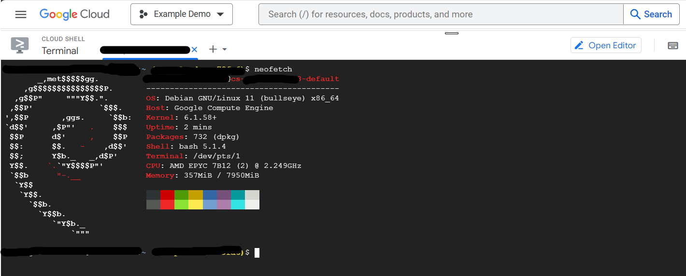
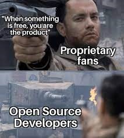

---
tags:
  - cloud-shell
---
## Google Cloud Shell

Siz https://cloud.google.com platformasida Linux'ni kompyuteringizga o'rnatmasdan bemalol ishlatishingiz mumkin:

```bash
khumoyun@cloud:~$ neofetch
```



## Ochiq dasturlar

Faoliyat yuritayotgan dasturlarni ko'rish uchun ishlatadigan buyruqlar ro'yxati:

```
$ ps
```

```
$ ps aux
```

```
$ top
```

`htop`  keng qo'llanilgan buyruqlardan biri, lekin bu standart dastur hisoblanmaydi. Shu sababli, uni avval dastur-menejeri orqali o'rnatish zarur:

```
$ sudo apt install htop -y
```

## Dastur joylashuvini topish

Sintaks:

```bash
$ whereis buyruq
```

Misol:

```bash
$ whereis aircrack-ng
aircrack-ng: /usr/bin/aircrack-ng /usr/include/aircrack-ng /usr/share/man/man1/aircrack-ng.1.gz
```

> **If it is free, then you're the product** - ya'ni agar biror narsa bepul bo'lsa, unda siz maxsulotsiz. Shu sababli, ayrim bepul dasturlarni ayniqsa VPN o'rnatayotganda ehtiyot choralarini ko'rishni maslahat beraman.



> **Pro maslahat:**
> Buyruq haqida qo'shimcha malumot olish uchun ko'pincha `--help` yoki qisqacha `-h` optsiyasini ishlatishingiz mumkin. Misol uchun: `python --help`


[< 04-dars](04-dars.md) | [06-dars >](06-dars.md)