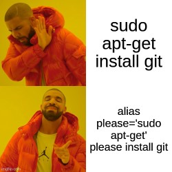
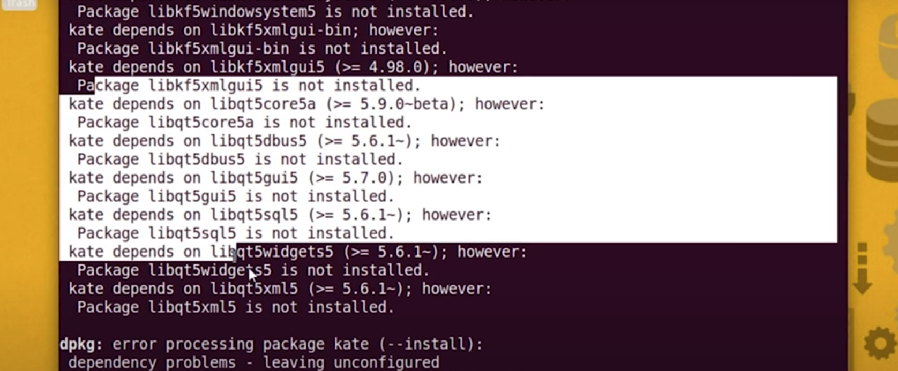
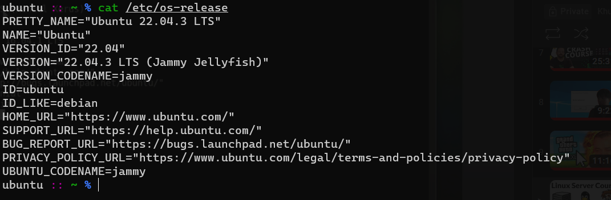
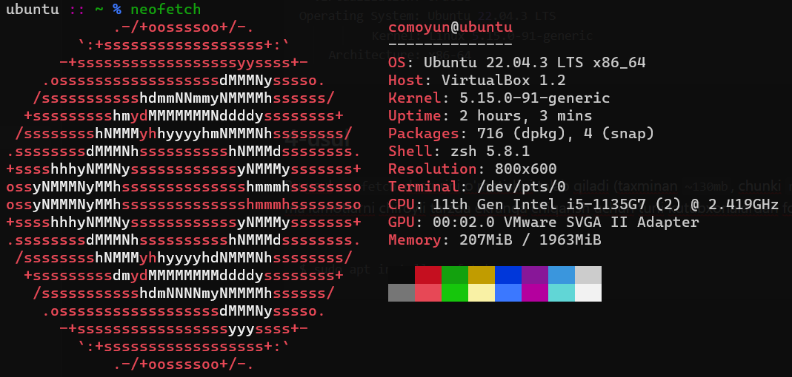

---

tags: ["ilovalar", "apt"]

---
## Ilova-menejeri buyruqlari

Paket menejeri (package-manager) internetdan turli dasturlarni o'rnatish, kompyuterdagi mavjud dasturlarni o'chirish/yangilash kabi xizmatlarni taqdim etadi. Paket menejeri barcha Linux distributlarida xar hil bo'lishi mumkin. Ubuntu va Debian'ga asoslangan distributlarda `apt`, Arch'ga asoslangan distributlarda `pacman` kommandasi ishlatiladi. Quyida `apt` yordamida turli-xil buyruqlarni ko'rib chiqamiz.

**P.S.** `apt-get`, `aptitude` va `apt` kommandalari bir xil vazifani bajaradi, ammo men `apt` buyrug'idan foydalanishni maslahat beraman chunki u yangi, osson va sayqallangan.

### 1. Kompyuterdagi barcha ilovalarni yangilash

Tizim optimal ishlashi uchun mavjud dasturlarni kun-ora yangilab turish maqsadga muvofiq. Buyruq:

```bash
$ sudo apt update $$ sudo apt upgrade
```

Bir-biriga qarama-qarshi bo'lgan dasturlarni eng yangi versiyaga yangilashga va eski foydalanilmagan (bog'liqlik mavjud bo'lmagan) dasturlarni olib tashlaydigan buyruq:

```bash
$ sudo apt dist-upgrade
```

### 2. Ilovalarni APT bilan o'rnatish

```bash
$ sudo apt install dastur-nomi -y
```

`-y` (yes) optsiyasi dastur o'rnatilayotgan paytda beriladigan savollarga "ha" deb javob beradi, huddi Windows'da ilova o'rnatayotganda "next, next, next" qilganimizdek. Masalan, VLC Media Player-ni Ubuntu-da o'rnatish jarayoni quyidagicha:

```bash
$ sudo apt install vlc -y
```



#### 2.5 Ilovalarni `dpkg` orqali o'rnatish

Xuddi Windows'dagi "exe" fayllarni ustanovka qilgan singari ilovalarni `dpkg` yordamida o'rnatish mumkin. Linux dasturlari "deb" kengaytmasiga ega va ularni o'rnatish quyidagicha:

```bash
$ sudo dpkg -i ilova.deb
```

 - `-i` (install) o'rnatish manosini bildiradi. 

Agar sizda pastdagiga o'xshash muommo paydo bo'lsa, dastur uchun kerakli fayllar o'rnatilmaganini bildiradi:



Muommoni hal qilish uchun `apt` yordamida qaram dasturlarni birma-bir o'rnatish zarur. 

### 3. Ilovalarni APT yordamida o'chirib tashlash

```bash
$ sudo apt remove dastur-nomi
```

Masalan, avval o'rnatilgan VLC dasturini o'chirish uchun:

```bash
$ sudo apt remove vlc
```

### 4. O'rnatish mumkin bo'lgan ilovalarni qidirish

```bash
$ sudo apt search dastur-nomi
```

## Qanday qilib ma'lum bir port bilan bog'langan dasturni topish mumkin? 

Buning uchun `lsof` (list-open-files) buyrug'ini "root" foydalanuvchi tomonidan beramiz. Mana bir misol:

```bash
$ sudo lsof -i:port_raqami
```

>`-i` optsiyasi internet so'zining qisqartmasi.

Yana bir misol, agar 80-port (veb-server) bilan bog'langan dasturni qidirayotgan bo'lsangiz, quyidagi kommandani terminalga uloqtiring:

```bash
$ sudo lsof -i:80
```

>Ko'pchilik `netstat -tulpn | grep :port_raqami` buyrug'idan foydalanadi, lekin bu ayrim dasturlar uchun samarasiz.

## Linux haqida malumot olish

Cloud serverlardan, yoki masofaviy kompyuterlarni boshqarayotganda sizga kompyuter nomi va versiya to'g'risidagi axborotlar kerak bo'ladi. Host kompyuter haqida malumot olishning ko'plab usullari bor, lekin biz faqat ayrimlarini ko'rib chiqamiz.

### 1-usul 

Unix'ga o'xshash operatsion tizimlardagi (jumladan, Linux) `/etc/` katalogi tizim va ilovalar uchun konfiguratsiya fayllarni va sozlamalarni ichiga oladi. `/etc` nomi "**et cetera**" ya'ni "**va hokazo**" degan ma'noni anglatadi. Katalog ichida kompyuterga bog'liq malumotlar ya'ni CPU, RAM, hosts, parollar va hokazolar fayl ko'rinishida saqlanadi. Operatsion sistema nomi va versiyalarini olish uchun `/etc/os-release` faylini o'qish kifoya.

```bash
$ cat /etc/os-release
```

Natija:



### 2-usul

`uname` buyrug'i tizim ma'lumotlarini, jumladan yadro versiyasini ko'rsatadi. `-a` optsiyasi "all" ya'ni barcha malumotni ko'rsatish degan ma'noni bildiradi.

```bash
$ uname -a
Linux ubuntu 5.15.0-91-generic #101-Ubuntu SMP Tue Nov 14 13:30:08 UTC 2023 x86_64 x86_64 x86_64 GNU/Linux
```

### 3-usul

```bash
$ hostnamectl
 Static hostname: ubuntu
       Icon name: computer-vm
         Chassis: vm
      Machine ID: e6cbca0afa744bbabaddf277c31812b0
         Boot ID: 67a12f1b087147d7979e4e00699ff1de
  Virtualization: oracle
Operating System: Ubuntu 22.04.3 LTS
          Kernel: Linux 5.15.0-91-generic
    Architecture: x86-64
```

### 4-usul 

Bu usul `neofetch` dasturini o'rnatishni talab qiladi (taxminan `~130mb`, chunki `neofetch` ma'lumotlarni chiroyli tarzda ekranga chiqarish uchun turli kutubxonalardan foydalanadi.)

```
$ sudo apt install neofetch -y
...
$ neofetch
```

Natija: 



[< 05-kun](05-dars.md) | [07-kun >](07-dars.md)