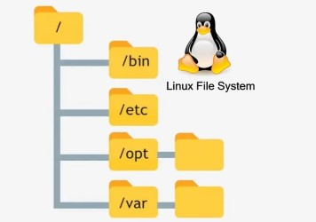
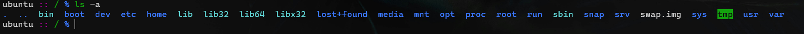

## Linux fayl tizimi



Linux fayl tizimi haqiqatan ham ajoyib, chunki barcha tarmoq tizimlari, disklar va usb drayvlar hammasi fayl ko'rinishida. Misol uchun, Windows'dagi **C** drayver, **D** drayver va h.k. Linux'ning `/dev/` (devices) katalogida oddiygina fayl sifatida ko'rinadi.

## `cd` haqida batafsil

Siz `cd` (change-directory) buyrug'i bilan tanish bo'lishingiz mumkin, chunki Windows, MacOS, KolibriOS va h.k.lar to'liq qo'llab quvvatlaydi. `cd` orqali boshqa kataloglarga "sakrash" mumkin. Deylik, siz fayl yaratdingiz, fayl terminal qayerdan ochilgan bo'lsa o'sha yerda saqlanadi. Bu yerda yaratilgan fayl `/home/khumoyun/experiments/` katalogida saqlangan:

```bash
$ touch file
$ ls
file papka
$ pwd
/home/khumoyun/experiments
```

Endi faylni "papka" ichida yaratmoqchisiz. Buning ikkita yo'li bor. Tajribali foydalanuvchi sifatida siz ushbu strategiyani qo'llashingiz mumkin:

```bash
$ touch papka/file
$ ls papka/
file
```

Ikkinchi usulda, siz avval papka ichiga sakraysiz, so'ng fayl yaratasiz:

```bash
$ cd papka
$ touch file
$ ls
file
```

Joriy papkadan bitta yuqoriga chiqish uchun `cd ..` buyrug'i beriladi. 

 - `cd .` - **1** nuqta joriy papkani o'zini anglatadi 
 - `cd ..` - **2** nuqta hozirgi papkadan bitta yuqoriga sakrashni bildiradi

**P.S.** *`./papka/file` = `papka/file`*

*Uch-to'rtta papka yuqoriga chiqmoqchi bo'lsakchi?* deb so'rasangiz, mana:

```bash
$ cd ../../../
```

yoki (tajribasiz usul):

```bash
$ cd ..
$ cd ..
$ cd ..
```

>**P.S.** o'sha nuqtalar aslida yashirin papka hisoblanadi. Buni `ls -a` buyrug'idan aniqlash mumkin.)
>


[< 06-kun](06-dars.md) | [08-kun >](08-dars.md)


